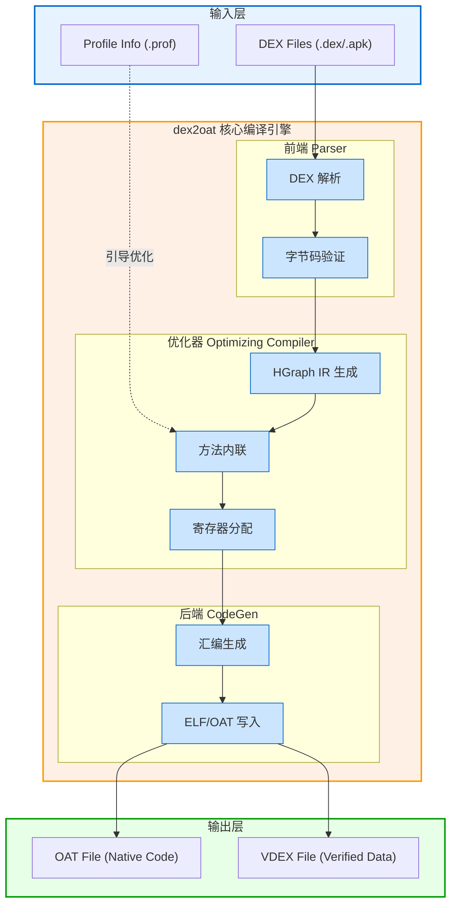

# dex2oat 模块核心流程与概念总结

`dex2oat` 是 Android Runtime (ART) 中负责 **AOT (Ahead-of-Time) 编译** 的核心工具。它将 DEX (Dalvik Executable) 字节码转换为机器码，并封装在 OAT 文件中，以提升应用的运行性能和启动速度。

## 1. 核心概念与术语

| 术语 | 说明 |
| :--- | :--- |
| **DEX (Dalvik Executable)** | Android 应用的原始字节码格式（`.dex` 文件）。 |
| **OAT (Optimized Android)** | 一种特殊的 ELF 文件格式，包含编译后的本地机器码（Native Code）及其元数据。 |
| **VDEX (Verified Dex)** | 包含经过校验的 DEX 文件及其索引映射，用于加速后续编译和减少校验开销。 |
| **ART (Android Runtime)** | 负责执行 DEX 和 OAT 文件的运行时环境。 |
| **AOT (Ahead-of-Time)** | 提前编译。在安装或设备空闲时将字节码转换为机器码。 |
| **JIT (Just-in-Time)** | 即时编译。在程序运行时动态编译热点代码（ART 是 AOT 与 JIT 混合架构）。 |
| **Profile-Guided Optimization (PGO)** | 基于配置文件的优化。利用 `profman` 生成的 `.prof` 文件，只编译用户常用的热点方法。 |

## 2. 核心执行流程

`dex2oat` 的执行可以概括为以下四个主要阶段：

### 第一阶段：初始化与参数解析 (`Setup`)
*   **入口**: `dex2oat.cc` 中的 `main` 函数启动 `Dex2Oat` 对象。
*   **解析**: 处理命令行参数（如 `--dex-file`, `--oat-file`, `--compiler-filter`, `--profile-file` 等）。
*   **运行时环境准备**: 初始化 `Runtime` 的简化版本，加载所需的镜像文件（Boot Image）。

### 第二阶段：解析与验证 (`Parsing & Verification`)
*   **加载 DEX**: 使用 `libdexfile` 解析输入的 `.dex` 或 `.apk` 文件。
*   **字节码验证**: 检查 DEX 字节码的合法性和类型安全性。验证通过的信息会存储在 **VDEX** 文件中，避免下次重复验证。

### 第三阶段：编译优化 (`Compilation`)
这是最耗时的阶段，由 `compiler/` 模块驱动：
1.  **IR 转换**: 将 DEX 字节码转换为中间表示（Intermediate Representation, 通常是 HGraph）。
2.  **优化路径 (Optimization Passes)**: 
    *   **常量折叠 (Constant Folding)**
    *   **死代码消除 (Dead Code Elimination)**
    *   **内联 (Inlining)**: 根据策略将小函数直接嵌入调用处。
    *   **寄存器分配**: 为变量分配物理寄存器。
3.  **代码生成 (Code Generation)**: 针对目标架构（ARM, ARM64, x86 等）生成本地机器指令。

### 第四阶段：文件生成 (`Writing`)
*   **OAT 写入**: 将生成的机器码、方法偏移量、类型信息等写入 ELF 格式的 OAT 文件。
*   **VDEX 更新**: 同步更新 VDEX 文件，确保其与 OAT 匹配。
*   **符号化**: 写入调试信息（如果开启了 `--debuggable`）。

## 3. 关键组件架构

## 4. 总结：为什么要 dex2oat？

1.  **性能最大化**: 通过 AOT 编译，应用在运行时不需要解释执行字节码，直接运行机器码。
2.  **资源权衡**: 虽然 AOT 编译会增加安装时间和存储空间（OAT 文件比 DEX 大），但它显著降低了运行时的 CPU 负载和耗电量。
3.  **灵活策略**: 通过 `--compiler-filter` 参数（如 `speed`, `speed-profile`, `verify`），系统可以根据应用的活跃度动态决定编译深度。例如，只有常用的应用才会通过 `speed-profile` 进行深度 AOT 优化。
