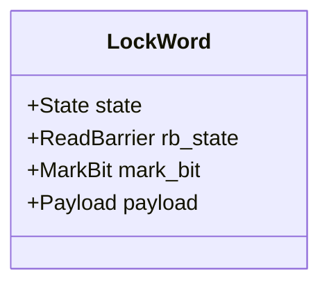

# ART Monitor 机制详解

本文档深入解析 Android Runtime (ART) 中 `synchronized` 关键字背后的 `Monitor` 实现机制，涵盖内存布局、加锁/解锁流程及源码分析。

## 1. 概述

ART 采用**混合锁 (Hybrid Lock)** 策略，旨在优化常见情况（无竞争）的性能，同时处理复杂情况（锁竞争、Wait/Notify）。

*   **Thin Lock (轻量级锁)**：
    *   **场景**：无竞争的锁定。
    *   **实现**：完全在用户态通过 CAS (Compare-And-Swap) 操作对象头中的 `LockWord`。
    *   **优势**：极快，无需内核介入，无需分配内存。
*   **Fat Lock (重量级锁)**：
    *   **场景**：锁竞争、递归深度溢出、或调用 `Object.wait()`。
    *   **实现**：分配 C++ `Monitor` 对象，使用系统级互斥量 (Mutex/Futex) 管理线程挂起与唤醒。
    *   **代价**：涉及内存分配、上下文切换和内核系统调用。

## 2. LockWord 内存布局

每个 Java 对象 (`mirror::Object`) 都有一个 32 位的 `LockWord`。它是一个多态的联合体，根据 **State (高2位)** 的不同，其余位的含义也不同。

### 2.1 位域划分 (Bit Layout)

根据 `runtime/lock_word.h` 中的定义 (以 32 位为例)：



#### A. Thin Lock (State = 0)
当 State 为 0 且 Owner 不为 0 时，表示 Thin Lock。

| Bit Range | Field | Description |
| :--- | :--- | :--- |
| **31-30** | **State (0)** | **kStateThinOrUnlocked (00)** |
| 29 | Mark Bit | GC 标记位 (用于并发 GC) |
| 28 | Read Barrier | 读屏障状态 (用于并发 Copying GC) |
| **27-16** | **Count** | **递归计数 (12 bits)**。0 表示重入 1 次。溢出(>4095) 则膨胀。 |
| **15-0** | **Owner** | **Thread ID (16 bits)**。持有锁的线程 ID。0 表示 Unlocked。 |

#### B. Fat Lock (State = 1)
当锁膨胀后，LockWord 存储 Monitor ID。

| Bit Range | Field | Description |
| :--- | :--- | :--- |
| **31-30** | **State (1)** | **kStateFat (01)** |
| 29 | Mark Bit | GC 标记位 |
| 28 | Read Barrier | 读屏障状态 |
| **27-0** | **MonitorId** | **Monitor ID (28 bits)**。索引指向堆中的 `Monitor` 对象。 |

#### C. Hash Code (State = 2)
当对象调用 `hashCode()` 且未被移动时，哈希值存这里。

| Bit Range | Field | Description |
| :--- | :--- | :--- |
| **31-30** | **State (2)** | **kStateHash (10)** |
| 29 | Mark Bit | GC 标记位 |
| 28 | Read Barrier | 读屏障状态 |
| **27-0** | **Hash** | **Identity Hash Code (28 bits)**。 |

#### D. Forwarding Address (State = 3)
GC 移动对象期间使用。

| Bit Range | Field | Description |
| :--- | :--- | :--- |
| **31-30** | **State (3)** | **kStateForwardingAddress (11)** |
| 29 | 0 | Unused |
| **28-0** | **Address** | **Forwarding Address** (对象新地址的偏移) |

## 3. 工作原理与流程

核心逻辑位于 `runtime/monitor.cc`。

### 3.1 加锁流程 (MonitorEnter)

加锁过程是一个从轻到重的尝试过程：**CAS 尝试 -> 自旋重试 -> 膨胀为 Fat Lock -> Mutex 挂起**。

#### 关键函数
*   `Monitor::MonitorEnter(Thread* self, ObjPtr<mirror::Object> obj, ...)`
*   `Monitor::InflateThinLocked(...)`
*   `Monitor::Lock(Thread* self)`

#### 流程图

```mermaid
graph TD
    Start([MonitorEnter]) --> GetLockWord{Get LockWord}
    
    GetLockWord -- "State == Unlocked (0)" --> CAS_Thin[CAS: Unlocked -> ThinLocked(Self)]
    CAS_Thin -- Success --> Acquired([Acquired Thin Lock])
    CAS_Thin -- Fail --> SpinWait
    
    GetLockWord -- "State == ThinLocked" --> CheckOwner{Owner == Self?}
    
    CheckOwner -- Yes --> CheckCount{Count < Max?}
    CheckCount -- Yes --> IncCount[Update Count (CAS/Store)] --> Acquired
    CheckCount -- No (Overflow) --> Inflate[Inflate to Fat Lock]
    
    CheckOwner -- No (Contention) --> SpinWait[Spin Loop (sched_yield)]
    
    SpinWait --> CheckRetry{Retry Count < Max?}
    CheckRetry -- Yes --> GetLockWord
    CheckRetry -- No --> InflateContended[InflateThinLocked]
    
    InflateContended --> SuspendOwner[Suspend Owner Thread]
    SuspendOwner --> AllocMonitor[Allocate Monitor Object]
    AllocMonitor --> UpdateLockWord[CAS: Thin -> Fat (MonitorId)]
    UpdateLockWord --> ResumeOwner[Resume Owner Thread]
    ResumeOwner --> FatLockPath
    
    GetLockWord -- "State == FatLocked" --> FatLockPath[Get Monitor from ID]
    Inflate -- "Done" --> FatLockPath
    
    FatLockPath --> MutexLock[Monitor::Lock (Mutex Acquire)]
    MutexLock --> AcquiredFat([Acquired Fat Lock])
    
    GetLockWord -- "State == HashCode" --> InflateHash[Inflate with Hash] --> FatLockPath
```

#### 详细步骤解析

1.  **快速路径 (Thin Lock)**:
    *   读取 `LockWord`。如果是 `Unlocked` (State=0, Owner=0)，直接通过 CAS 修改为 `ThinLocked` (State=0, Owner=Self)。成功则立即返回。
2.  **重入 (Recursion)**:
    *   如果是 `ThinLocked` 且 Owner 是自己，增加计数。如果计数未溢出 (<= 4095)，直接更新 `LockWord` 返回。
3.  **自旋 (Spinning)**:
    *   如果锁被其他线程持有，当前线程会进行短时间的自旋 (`sched_yield`)，避免立即进入内核态挂起。
4.  **膨胀 (Inflation)**:
    *   如果自旋后仍未获取锁，调用 `InflateThinLocked`。
    *   **关键点**：为了安全地将 Thin Lock 转换为 Fat Lock，当前线程必须**挂起 (Suspend)** 锁的持有线程（Owner）。
    *   在持有者暂停期间，分配一个新的 `Monitor` 对象，将原有的 Owner 和 Count 复制进去，然后将对象的 `LockWord` 更新为指向该 `Monitor` 的 ID。
    *   恢复持有者线程。
5.  **重量级锁 (Fat Lock)**:
    *   一旦变为 Fat Lock，所有后续操作都代理给 `Monitor` 对象。
    *   调用 `Monitor::Lock()`，内部使用 `art::Mutex::ExclusiveLock`，最终可能调用 `futex` 系统调用将当前线程挂起，直到锁释放。

### 3.2 解锁流程 (MonitorExit)

解锁是对称的操作，需处理降级或唤醒等待者。

#### 关键函数
*   `Monitor::MonitorExit(Thread* self, ObjPtr<mirror::Object> obj)`
*   `Monitor::Unlock(Thread* self)`

#### 流程图

```mermaid
graph TD
    Start([MonitorExit]) --> GetLockWord{Get LockWord}
    
    GetLockWord -- "State == ThinLocked" --> CheckOwner{Owner == Self?}
    
    CheckOwner -- No --> ThrowEx[Throw IllegalMonitorStateException]
    
    CheckOwner -- Yes --> CheckCount{Count > 0?}
    CheckCount -- Yes --> DecCount[Decrement Count] --> Done([Done])
    CheckCount -- No (Count==0) --> Release[CAS: ThinLocked -> Unlocked] --> Done
    
    GetLockWord -- "State == FatLocked" --> FatUnlock[Monitor::Unlock]
    
    FatUnlock --> CheckFatOwner{Monitor Owner == Self?}
    CheckFatOwner -- No --> ThrowEx
    
    CheckFatOwner -- Yes --> DecFatCount{Lock Count > 0?}
    DecFatCount -- Yes --> DecFat[Decrement Monitor Count] --> Done
    
    DecFatCount -- No --> ReleaseMutex[Mutex Unlock]
    ReleaseMutex --> Signal[Signal Waiters (Futex Wake)] --> Done
```

#### 详细步骤解析

1.  **Thin Lock 解锁**:
    *   验证当前线程是否为 Owner。
    *   减少递归计数。如果计数 > 0，更新并返回。
    *   如果计数为 0，使用 CAS 将 `LockWord` 恢复为 `Unlocked` (State=0, Owner=0)。
2.  **Fat Lock 解锁**:
    *   获取对应的 `Monitor` 对象。
    *   调用 `Monitor::Unlock()`。
    *   减少 `Monitor` 内部的 `lock_count_`。
    *   如果计数归零，调用 `monitor_lock_.ExclusiveUnlock()` 释放互斥量。
    *   如果有线程在等待 (`wake_set_`)，操作系统会通过 Futex 唤醒它们。

## 4. 源码关联

以下是相关代码在 ART 源码树中的位置：

*   **`runtime/monitor.cc`**: 核心实现。
    *   `MonitorEnter`: 入口函数。
    *   `InflateThinLocked`: 处理锁膨胀，包含线程挂起逻辑。
    *   `Lock` / `Unlock`: 基于 `Mutex` 的重量级锁实现。
*   **`runtime/lock_word.h`**: `LockWord` 类定义及位运算逻辑。
*   **`runtime/mirror/object.h`**: 对象头定义，包含 `GetLockWord` / `CasLockWord`。
*   **`runtime/monitor-inl.h`**: `Monitor` 的内联辅助函数。

**Android.bp 模块定义**:
这些文件属于 `libart-runtime` 库，定义在 `runtime/Android.bp` 中：

```bp
cc_library {
    name: "libart-runtime",
    srcs: [
        "monitor.cc",
        "runtime.cc",
        // ...
    ],
    // ...
}
```

## 5. 测试与验证

ART 提供了单元测试来验证 Monitor 的行为。

### 相关测试文件
*   **`runtime/monitor_test.cc`**: C++ 单元测试，直接测试 `Monitor` 类 API，模拟竞争和膨胀。
*   **`test/004-SignalTest/`**, **`test/088-monitor-verification/`**: 集成测试（Run-tests）。

### 运行测试示例

在 Android 源码根目录下运行：

```bash
# 运行 monitor_test (GTest)
./art/test.py --host -g --gtest_filter="MonitorTest.*"

# 运行特定的集成测试
./art/test.py --host -r -t 088-monitor-verification
```

这些测试会验证：
1.  **基本加锁/解锁**：确保同一线程可重入，不同线程互斥。
2.  **锁膨胀**：模拟竞争，验证 Thin Lock 是否正确升级为 Fat Lock。
3.  **Wait/Notify**：验证等待队列和唤醒逻辑。
4.  **HashCode 保存**：验证加锁后 HashCode 是否丢失（应保存在 Monitor 中）。
