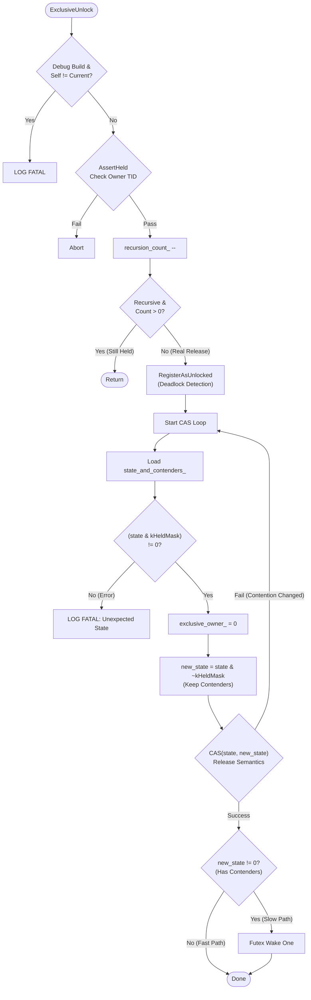

# ART Mutex::ExclusiveUnlock 源码深度解析

本文基于 Android Runtime (ART) 源码 (`runtime/base/mutex.cc`)，详细解析 `Mutex::ExclusiveUnlock` 方法的实现逻辑。该方法实现了互斥锁的释放，特别是基于 **Futex** 的高效无锁路径与内核唤醒机制。

## 1. 核心流程概览

`ExclusiveUnlock` 的设计目标是：**在无竞争情况下完全在用户态完成（Zero Syscall），仅在有竞争时才陷入内核唤醒等待者。**



## 2. 源码逐行精讲

以下代码片段取自 `runtime/base/mutex.cc`。

### 2.1. 健全性检查与递归处理

```cpp
void Mutex::ExclusiveUnlock(Thread* self) {
  // 1. 线程身份检查 (Debug 模式)
  if (kIsDebugBuild && self != nullptr && self != Thread::Current()) {
    // 省略日志打印...
    LOG(FATAL) << "不能帮其他线程解锁";
  }

  // 2. 锁持有状态断言
  AssertHeld(self);                   // 确保当前线程在逻辑上持有锁
  DCHECK_NE(GetExclusiveOwnerTid(), 0); // 确保锁确实被某人持有

  // 3. 递归计数处理
  recursion_count_--;
  // 如果是递归锁且计数未归零，说明还处于嵌套锁中，只需减计数，不真正释放。
  if (!recursive_ || recursion_count_ == 0) {
    if (kDebugLocking) {
      CHECK(recursion_count_ == 0 || recursive_) << "非递归锁的计数异常";
    }
    
    // 4. 注销锁 (用于死锁检测与 Lock Level 检查)
    RegisterAsUnlocked(self);
```

### 2.2. 物理释放 (Futex 实现)

这是性能最关键的部分。ART 使用一个原子整数 `state_and_contenders_` 来同时存储锁状态和竞争者数量。

*   **Bit 0 (kHeldMask)**: 1 表示持有，0 表示空闲。
*   **High Bits**: 表示竞争者（Waiters）的数量。

```cpp
#if ART_USE_FUTEXES
    bool done = false;
    do {
      // 5. 读取当前原子状态 (Relaxed 序，因为后面有 CAS)
      int32_t cur_state = state_and_contenders_.load(std::memory_order_relaxed);
      
      // 6. 再次确认锁是被持有的 (Bit 0 为 1)
      if (LIKELY((cur_state & kHeldMask) != 0)) {
        
        // 7. 清除所有者记录
        // 在修改状态前，先将 Owner TID 设为 0。
        // 这是逻辑上的释放点。
        exclusive_owner_.store(0 /* pid */, std::memory_order_relaxed);
        
        // 8. 计算新状态
        // 保留高位的竞争者数量，仅清除低位的持有位。
        // new_state = cur_state & ~1
        uint32_t new_state = cur_state & ~kHeldMask;

        // 9. 执行原子 CAS (Compare-And-Swap)
        // 尝试将 cur_state 更新为 new_state。
        // memory_order_release: 保证临界区内的所有写操作在此之前完成 (Happens-Before)。
        done = state_and_contenders_.CompareAndSetWeakRelease(cur_state, new_state);
        
        if (LIKELY(done)) { 
          // CAS 成功，锁已物理释放。
          
          // 10. 判断是否需要唤醒 (Slow Path)
          // 如果 new_state 不为 0，说明去掉了持有位后，剩下的数字不为 0。
          // 这意味着还有高位的竞争者在排队 (Contenders > 0)。
          if (UNLIKELY(new_state != 0)) {
            // 调用 Linux 系统调用 futex(FUTEX_WAKE)
            // 唤醒一个在 wait 队列中的线程。
            futex(state_and_contenders_.Address(), FUTEX_WAKE_PRIVATE, kWakeOne,
                  nullptr, nullptr, 0);
          }
          // 如果 new_state == 0，说明没有竞争者，直接结束 (Fast Path)。
        }
      } else {
        // 异常：尝试释放一个没被持有的锁
        LOG(FATAL) << "Unexpected state_ in unlock " << cur_state;
      }
    } while (!done); // 如果 CAS 失败 (通常因为在此期间有新线程加入竞争)，重试循环
#else
    // Pthread 回退实现
    exclusive_owner_.store(0, std::memory_order_relaxed);
    CHECK_MUTEX_CALL(pthread_mutex_unlock, (&mutex_));
#endif
  }
}
```

## 3. 关键机制总结

1.  **Release 语义**: `CompareAndSetWeakRelease` 确保了内存可见性。在锁释放之前，该线程在临界区内对共享变量的所有修改，都会对下一个获得锁的线程可见。
2.  **User-Space Fast Path**: 绝大多数情况下，`cur_state` 只有 Bit 0 被置位（值为 1）。CAS 将其变为 0 后，`new_state` 为 0，`if (new_state != 0)` 为假，直接返回。**不需要陷入内核，没有 Context Switch。**
3.  **Contention Handling**: 只有当 `state_and_contenders_` 的高位不为 0 时，才执行 `futex` 唤醒。这精确地只在“真有人在等”的时候才付出系统调用的代价。
